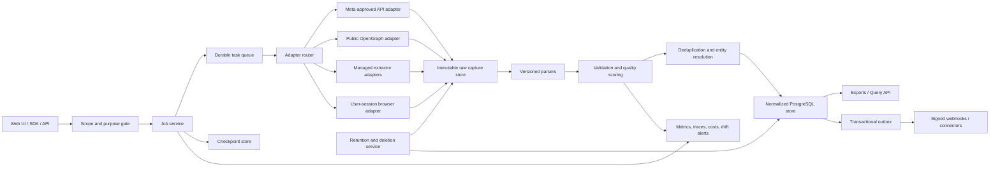

# Facebook data collection product research

**Research date:** 2026-07-29  
**Scope:** Four unique input resources, plus directly relevant product, code, pricing, API, policy, and maintenance evidence.  
**Method:** Read-only inspection. No repository changes. No live Facebook collection.  
**Status terms:** **Verified** = observed in code or current operational documentation; **Claimed** = vendor or tutorial assertion without reproducible proof; **Partial** = implemented for a limited surface or field set; **Absent** = inspected evidence shows no capability; **Unknown** = evidence does not resolve the question.

# Executive conclusion

- **Strongest competitor pattern:** The strongest pattern combines managed cloud execution, session reuse, no-code workflows, structured exports, schedules, and integrations. Customers buy maintenance transfer and workflow convenience, not extraction code alone.
- **Largest unmet opportunity:** None of the inspected products demonstrates an evidence-grade reliability layer. Missing controls include field-level completeness contracts, durable checkpoints, replayable raw captures, schema lineage, confidence scoring, and measured drift recovery.
- **Recommended defensible position:** Build a **public-business intelligence reliability platform**. Start with Pages, owned/public Posts, Ads Library records, and Events. Differentiate through measurable completeness, provenance, resumability, deletion controls, and transparent data-quality SLAs.
- **Do not lead with “scrapes everything.”** ChocoData’s repository proves narrow OpenGraph extraction. Its broader product pages use templated examples. PhantomBuster documents useful workflows but exposes strict operational ceilings. Thunderbit documents a capable generic platform, while its Facebook-specific examples remain marketing claims.
- **Commercial model:** Price by successfully validated records and retained history. Include API, schedules, webhooks, and team access. Meter expensive browser work separately.

# Source inventory

| Resource | Type | Freshness | What was inspected | Evidence quality | Key limitations |
|---|---|---:|---|---|---|
| [Chayuto technical review](https://chayuto.com/blog/building-free-facebook-scraper-tools/) | Tutorial / secondary technical review | 2026-02-02 | Architecture taxonomy, mobile-web recommendation, cookie/session discussion, interaction parsing, performance assertions, cited repositories | Medium for technique inventory; low for performance claims | No attached benchmark harness. Several figures are attributed without reproducible test artifacts. “Self-healing” and computer-vision designs are suggestions, not demonstrated implementations. |
| [ChocoData-com/facebook-scraper](https://github.com/ChocoData-com/facebook-scraper) | Source code plus hosted-product documentation and marketing | Commit [f951e1e](https://github.com/ChocoData-com/facebook-scraper/commit/f951e1e088ce52c3c827bdaa0cd3e51a90c8ca3e), 2026-07-24 | Full tree, dependency, free scraper, API examples, JSON samples, SQLite monitor, license, commits, issues, Actions, releases | High for repository code; medium for captured samples; low-to-medium for opaque hosted-service claims | Seven commits, no releases, no CI workflow, no unit-test suite. Hosted extraction implementation is not present. |
| [PhantomBuster](https://phantombuster.com/) | Hosted product, documentation, and marketing | Live catalog and pricing inspected 2026-07-29; support articles updated April 2026 | Current Facebook catalog, three automation pages, inputs, outputs, workflow limits, cloud model, exports, API, pricing, integrations, privacy, deletion | High for current catalog and plan limits; medium for extraction-field claims | Closed implementation. No independent Facebook output test. Marketing copy conflicts on public email availability. Group jobs lack mid-list resume. |
| [Thunderbit Facebook GitHub guide](https://thunderbit.com/blog/facebook-scraper-github-guide) | Tutorial, competitive research, and product marketing | 2026-06-02 | Repository audit claims, product workflow, Facebook output examples, exports, scheduling, setup advice; followed current product and API documentation | Medium for product workflow; low for Facebook-specific output and competitor audit figures | Article promotes Thunderbit. Facebook samples are illustrative. No attached run receipts, fixture set, or benchmark data. |

**Deduplication:** `Research These.txt` contains five rows and four unique URLs. The repeated Chayuto URL was inspected once.

# Competitor feature matrix

| Normalized capability | ChocoData free script | ChocoData managed API | PhantomBuster | Thunderbit |
|---|---|---|---|---|
| Public Page identity and headline counts | **Verified** | **Verified** contract/sample | **Unknown** | **Claimed** |
| Public Page About/contact fields | **Partial** — OpenGraph only | **Partial** — several null fields | **Partial** — profile scraper claims visible contact fields | **Claimed** |
| Individual public Post copy/media | **Absent** | **Partial** — caption is truncated; engagement null | **Unknown** | **Claimed** |
| Post comments and reactions | **Absent** | **Claimed** on product page; absent from repository contract | **Unknown** | **Claimed** |
| Group metadata | **Absent** | **Partial** — no members or member posts | **Absent** | **Claimed** |
| Group-member export | **Absent** | **Absent** in repository; product page unclear | **Verified** — current automation | **Claimed** |
| Profiles | **Absent** | **Claimed** on product page; excluded by repository | **Verified** current workflow | **Claimed** |
| Events | **Absent** | **Partial** — core structured fields often null | **Unknown** | **Claimed** |
| Marketplace items | **Absent** | **Claimed** with placeholder response | **Absent** | **Claimed** |
| Ads Library records | **Absent** | **Claimed** with placeholder response | **Absent** | **Unknown** |
| Discovery by keyword/type | **Absent** | **Claimed** — `top/posts/people/pages/groups/events` | **Partial** — name-to-URL finder | **Partial** — generic page discovery, not Facebook-specific |
| URL, slug, ID inputs | **Partial** — one vanity | **Verified** for repository endpoints | **Verified** | **Verified** generic URL lists |
| Bulk input | **Absent** | **Partial** — client-side concurrency only | **Verified** lists/sheets | **Verified** up to 100 API URLs per batch |
| Logged-out collection | **Verified** | **Verified** contract for four repository endpoints | **Absent** for two extractors; URL finder differs | **Partial** |
| User-session collection | **Absent** | **Absent** in repository | **Verified** cookie via extension | **Verified** browser mode |
| Durable checkpoint/resume | **Absent** | **Absent** in examples | **Partial** — some list progress; group mid-list resume absent | **Partial** — batch job states, not source cursors |
| Automatic retry/backoff | **Absent** | **Claimed** service-side; examples exit on errors | **Partial** configurable retries | **Verified** for API rate and webhook guidance |
| Proxy/geo controls | **Absent** | **Claimed** residential and country routing | **Verified** documented proxy support | **Verified** generic API geo/proxy routing |
| Raw-capture retention and replay | **Absent** | **Unknown** | **Unknown** | **Unknown** |
| Data validation | **Partial** — payload gate | **Claimed** parity checks | **Unknown** | **Partial** schema output; AI accuracy not guaranteed |
| Deduplication/entity resolution | **Absent** | **Absent** | **Unknown** | **Unknown** |
| CSV export | **Absent** | **Absent** in API examples | **Verified** | **Verified** |
| JSON/API output | **Partial** console output | **Verified** JSON | **Verified** | **Verified** |
| Webhooks | **Absent** | **Absent** synchronous API | **Verified** configurable platform webhook/API | **Verified** signed batch webhooks |
| Scheduling | **Absent** | **Partial** local monitor expects cron | **Verified** | **Verified** |
| No-code UI and job visibility | **Absent** | **Partial** dashboard claimed | **Verified** | **Verified** |
| Explicit retention/deletion controls | **Absent** | **Unknown** | **Verified** account/workspace deletion | **Partial** 30-day post-termination export window |
| Transparent reliability benchmark | **Partial** small author tests | **Claimed** | **Absent** | **Absent** for Facebook |
| License portability | **Verified** MIT | **Absent** hosted service | **Absent** hosted service | **Absent** hosted service |

## Matrix interpretation

1. **ChocoData repository and product conflict.** The repository says four endpoints and excludes personal data. The current product catalog advertises search, ads, comments, Marketplace, and profile endpoints. Treat the extra endpoints as claims until representative responses pass independent tests.
2. **PhantomBuster’s current Facebook catalog contains three automations:** Group Members Export, Profile Scraper, and Profile URL Finder. Older automation pages can remain indexed after deprecation.
3. **Thunderbit’s generic infrastructure is documented.** Facebook-specific field coverage, pagination completion, and durability remain unmeasured.

# Architecture findings

## 1. ChocoData free script

### Components

- HTTP fetcher using `requests`.
- Truthful static User-Agent.
- regular-expression `<meta>` reader.
- OpenGraph/deep-link Page parser.
- CLI printer and payload-based failure classifier.

### Data flow

`Page vanity → HTTP GET → HTML → meta-tag map → normalized Page record → console`

### State model

Stateless. Each run processes one vanity. It stores no cursor, raw response, observation, or audit record.

### Dependencies

Only [`requests>=2.31.0`](https://github.com/ChocoData-com/facebook-scraper/blob/f951e1e088ce52c3c827bdaa0cd3e51a90c8ca3e/requirements.txt#L1).

### Resilience mechanisms

- Uses a declared client identity and 30-second timeout.
- Parses data before classifying blocks.
- Rejects login-wall titles and empty OpenGraph payloads.
- Supports both attribute orders in `<meta>` tags.
- Handles Windows UTF-8 console output.

### Scaling limits

The script performs one synchronous request. It has no connection pooling, retry policy, concurrency, queue, checkpoints, or backpressure.

### Important code paths

- Fetch and parser: [`free_scraper/facebook_free_scraper.py:45-91`](https://github.com/ChocoData-com/facebook-scraper/blob/f951e1e088ce52c3c827bdaa0cd3e51a90c8ca3e/free_scraper/facebook_free_scraper.py#L45-L91)
- Payload gate: [`facebook_free_scraper.py:94-119`](https://github.com/ChocoData-com/facebook-scraper/blob/f951e1e088ce52c3c827bdaa0cd3e51a90c8ca3e/free_scraper/facebook_free_scraper.py#L94-L119)
- User-Agent diagnostic: [`free_scraper/ua_test.py:26-78`](https://github.com/ChocoData-com/facebook-scraper/blob/f951e1e088ce52c3c827bdaa0cd3e51a90c8ca3e/free_scraper/ua_test.py#L26-L78)

### Local verification

- Python syntax compilation passed for every `.py` file.
- A synthetic OpenGraph fixture passed name, ID, count, tagline, and login-shell checks.
- This local test did not verify current live Facebook behavior.

## 2. ChocoData API examples and monitor

### Components

- Four synchronous client wrappers: Page, Post, Group, Event.
- API-key query authentication.
- Status-to-message mapping.
- Captured JSON samples.
- SQLite Page observation monitor.

### Data flow

`Input URL/ID → ChocoData synchronous endpoint → JSON → client validation → consumer`

The monitor adds:

`Page rows → SQLite observations → relative noise-floor comparison → console alert`

### State model

- API state is opaque.
- Example clients are stateless.
- `page_monitor.py` stores timestamped observations in one SQLite table.
- No run table, source version, attempt log, checkpoint, or raw-response archive exists.

### Dependencies

`requests`, plus Python standard-library `sqlite3` for the monitor.

### Resilience mechanisms

- Actionable handling for `400`, `401`, `402`, `429`, and `502`.
- Invalid Page rows are rejected by payload content, not HTTP status.
- Group code detects a reduced document variant.
- Event code uses best-effort English regex recovery.
- Examples do not implement automatic retry, jitter, circuit breaking, or idempotent job recovery.

### Scaling limits

The repository documents synchronous GETs and concurrency ceilings of 10, 30, 50, and 100–500+. It documents no async job or callback. These are service claims, not repository implementation.

### Important code paths

- Page existence gate: [`facebook_scraper_api_codes/page.py:48-68`](https://github.com/ChocoData-com/facebook-scraper/blob/f951e1e088ce52c3c827bdaa0cd3e51a90c8ca3e/facebook_scraper_api_codes/page.py#L48-L68)
- Post limitations: [`post.py:10-14`](https://github.com/ChocoData-com/facebook-scraper/blob/f951e1e088ce52c3c827bdaa0cd3e51a90c8ca3e/facebook_scraper_api_codes/post.py#L10-L14)
- Group field availability: [`group.py:10-19`](https://github.com/ChocoData-com/facebook-scraper/blob/f951e1e088ce52c3c827bdaa0cd3e51a90c8ca3e/facebook_scraper_api_codes/group.py#L10-L19)
- Event recovery limits: [`event.py:65-90`](https://github.com/ChocoData-com/facebook-scraper/blob/f951e1e088ce52c3c827bdaa0cd3e51a90c8ca3e/facebook_scraper_api_codes/event.py#L65-L90)
- Monitor schema and write path: [`page_monitor.py:98-149`](https://github.com/ChocoData-com/facebook-scraper/blob/f951e1e088ce52c3c827bdaa0cd3e51a90c8ca3e/facebook_scraper_api_codes/page_monitor.py#L98-L149)

### Maintenance and license

- Seven commits exist between 2026-07-16 and 2026-07-24.
- GitHub shows no releases.
- No CI workflow or unit-test directory exists.
- The repository is [MIT licensed](https://github.com/ChocoData-com/facebook-scraper/blob/f951e1e088ce52c3c827bdaa0cd3e51a90c8ca3e/LICENSE#L1-L20).

## 3. PhantomBuster

### Components

- Browser extension for session-cookie transfer.
- Cloud-hosted “Phantom” workers.
- Prebuilt single-task automations and chained workflows.
- Scheduler, results UI, API, webhooks, proxies, and integrations.
- CSV and JSON result storage.

### Data flow

`User URLs/names/sheet + session cookie → cloud Phantom → platform page → extracted rows → cumulative CSV/latest JSON → sheet, API, webhook, or next Phantom`

### State model

- Each Phantom has a console and results files.
- CSV accumulates results across runs. JSON represents the latest run.
- Renaming a results file resets progress and starts a new file.
- Group member extraction must finish 4–5k results in one launch. It does not resume mid-list.

### Dependencies

The implementation is closed. Public documentation confirms an extension, cloud workers, user session cookies, optional proxies, and integrations.

### Resilience mechanisms

- User-session reuse.
- Proxy support and fixed-location guidance.
- Configurable retries, scheduling, notifications, and webhooks.
- Moderate-rate recommendations.
- No public parser contracts, selector tests, raw-capture replay, or Facebook completeness metrics were found.

### Scaling limits

- Group Members Export: up to 5,000 members, recommended 4–5k in one launch.
- Profile Scraper: recommended maximum five profiles per hour.
- Current annual pricing: Trial, Start €56/month, Grow €128/month, Scale €352/month.
- Paid tiers provide 5/15/50 slots and 20/80/300 execution hours monthly.

### Important public paths

- [Current Facebook catalog](https://phantombuster.com/phantombuster?category=facebook)
- [Facebook Group Members Export](https://phantombuster.com/phantombuster/6987/facebook-group-members-export)
- [Facebook Profile Scraper](https://phantombuster.com/phantombuster/8369/facebook-profile-scraper)
- [Facebook Profile URL Finder](https://phantombuster.com/phantombuster/4371/facebook-profile-url-finder)
- [Pricing](https://phantombuster.com/pricing)
- [API overview](https://support.phantombuster.com/hc/en-us/articles/4401916698130-Get-started-with-the-PhantomBuster-API)
- [Results and exports](https://support.phantombuster.com/hc/en-us/articles/360015513580-How-to-Access-and-Export-your-PhantomBuster-Results)
- [Deletion](https://support.phantombuster.com/hc/en-us/articles/360017550480-How-to-Delete-your-PhantomBuster-Account-or-Workspaces)

## 4. Thunderbit

### Components

- Browser extension and browser-mode extraction.
- Cloud/background extraction.
- AI-generated scraper templates and per-field instructions.
- Pagination, scrolling, subpage scraping, URL-list input.
- Scheduled scraping and export UI.
- Open API with synchronous and asynchronous batch endpoints.
- Signed webhooks and API integrations.

### Data flow

Interactive:

`Current page/URL list → AI-suggested schema → browser/cloud extraction → table → CSV/Excel/Sheets/Airtable/Notion/JSON`

API:

`URL + JSON Schema → sync result` or `≤100 URLs → async batch → poll/webhook → fetch partial/final rows`

### State model

- Batch states: `PENDING`, `PROCESSING`, `COMPLETED`, `FAILED`, `CANCELLED`.
- Each URL has its own status.
- Partial results are readable while processing.
- No documented source cursor or per-page checkpoint exists.

### Dependencies

Closed platform. Documentation identifies browser execution, cloud execution, AI models, proxy/geo routing, and third-party exports.

### Resilience mechanisms

- JavaScript rendering and generic anti-bot handling.
- Async partial-failure isolation.
- `429` reset headers and exponential-backoff guidance.
- Signed webhooks with three delivery retries.
- JSON Schema extraction.
- Terms explicitly state that AI output and scraping success are not guaranteed.

### Scaling limits

- Batch API accepts up to 100 URLs.
- Documented API limits: Free 10 requests/minute and 2 concurrent; Pro 100/minute and 10 concurrent; Enterprise 1,000/minute and 50 concurrent.
- Pricing documentation lists row-credit plans, but the current pricing page does not expose consumer plan cards in its static content. Treat the older documentation values as potentially stale.

### Important public paths

- [Product quick start](https://docs.thunderbit.com/)
- [Browser versus background](https://docs.thunderbit.com/basic/browser-vs-background)
- [Pagination and scrolling](https://docs.thunderbit.com/basic/pagination-and-scrolling)
- [Open API introduction](https://thunderbit.com/docs/introduction)
- [Batch lifecycle](https://thunderbit.com/docs/guides/batch-lifecycle)
- [Rate limits](https://thunderbit.com/docs/guides/rate-limits)
- [Webhooks](https://thunderbit.com/docs/guides/webhooks)
- [Terms](https://thunderbit.com/terms)

## Tutorial evidence: implemented versus suggested

| Technique | Chayuto review | Thunderbit guide | Classification |
|---|---|---|---|
| Browser automation | Described | Product-supported generically | Implemented by hosted products; tutorial alone proves nothing |
| Direct OpenGraph parsing | Described | Discussed as fragile | Implemented in ChocoData free script |
| Hybrid browser + parser | Recommended | Discussed | Inferred design; no inspected repository proves this exact pipeline |
| Mobile-site pivot | Recommended | Discussed through stale repos | Tutorial suggestion; no current test |
| Recursive comment expansion | Recommended | Product claim | Tutorial suggestion / product claim |
| Cookie injection | Recommended | Browser mode discussed | Implemented by PhantomBuster |
| Multi-account orchestration | Recommended | Discussed | Unverified and high-maintenance |
| AI self-healing selectors | Recommended | Marketed | No inspected Facebook benchmark |
| Computer-vision navigation | Recommended | Not central | Concept only |
| 97% success and 2–4 seconds/post | Asserted | Other figures asserted | Unverified; exclude from product sizing |

# Product gaps and opportunities

Scores use 1–5, where 5 is best except maintenance burden, where 5 means costly.

| Rank | Opportunity | Customer value | Differentiation | Feasibility | Maintenance burden | Evidence strength | Decision |
|---:|---|---:|---:|---:|---:|---:|---|
| 1 | Evidence-grade completeness, provenance, and drift detection | 5 | 5 | 4 | 3 | 5 | Build first |
| 2 | Durable checkpoints and replayable jobs | 5 | 5 | 5 | 2 | 5 | Build first |
| 3 | Public-business monitoring with noise-aware change detection | 5 | 4 | 5 | 2 | 5 | Build first |
| 4 | Adapter-neutral schema and fallback routing | 5 | 4 | 4 | 4 | 5 | Build early |
| 5 | Field-level confidence and reason codes for nulls | 5 | 5 | 4 | 3 | 5 | Build early |
| 6 | Retention, deletion, and source-purpose controls | 4 | 5 | 4 | 3 | 5 | Build early |
| 7 | Customer-visible job diagnostics and cost forecasts | 4 | 4 | 5 | 2 | 5 | Build in Phase 2 |
| 8 | Signed webhooks and warehouse connectors | 4 | 3 | 5 | 2 | 5 | Build in Phase 2 |
| 9 | Search, Marketplace, comments, and profiles | 4 | 2 | 2 | 5 | 2 | Gate behind measured pilots |
| 10 | AI selector repair | 3 | 3 | 3 | 5 | 2 | Add only after deterministic baselines |

## Why these gaps matter

- ChocoData exposes field gaps but lacks a durable job system.
- PhantomBuster offers workflow convenience but documents hard throughput and resume limits.
- Thunderbit offers stronger generic API orchestration but provides no Facebook-specific quality contract.
- Tutorials emphasize access tactics. Customers still lack proof that datasets are complete, fresh, and reproducible.

# Recommended architecture



## Collection pipeline

1. Validate the dataset purpose, object types, allowed fields, retention, and adapter eligibility.
2. Normalize URLs, IDs, keywords, and customer-supplied lists into immutable targets.
3. Select the lowest-cost adapter meeting the field contract.
4. Create deterministic task and idempotency keys.
5. Fetch and retain encrypted raw evidence with adapter, locale, schema, and timestamp metadata.
6. Parse with versioned deterministic code.
7. Validate required fields, semantic types, invariants, and visible-source parity.
8. Retry only classified transient failures. Route contract failures to drift review.
9. Deduplicate with stable platform IDs, canonical URLs, and observation timestamps.
10. Commit normalized rows and checkpoints in one transaction.
11. Publish outbox events after commit.
12. Apply retention and deletion policies to normalized and raw stores.

## Job and checkpoint model

### Job

`job_id, tenant_id, purpose_id, dataset_contract_id, input_digest, schedule_id, priority, state, created_at, started_at, completed_at`

### Task

`task_id, job_id, target_id, adapter_id, adapter_version, partition_key, state, attempt, next_attempt_at, lease_until, last_error_code`

### Checkpoint

`task_id, cursor_type, cursor_value, page_number, last_item_id, source_watermark, committed_count, checkpoint_version`

### State rules

- Use `QUEUED → LEASED → RUNNING → VALIDATING → COMMITTED`.
- Use terminal states `COMPLETED`, `PARTIAL`, `FAILED`, `CANCELLED`.
- Advance checkpoints only with normalized-row commits.
- Use `(tenant, contract, target, source_item_id, observed_at_bucket)` as an idempotency boundary.
- Keep failed row reasons separate from failed job reasons.

## Storage model

| Store/table | Purpose |
|---|---|
| `dataset_contract` | Required objects, fields, freshness, quality thresholds, retention |
| `source_target` | Canonical URL/ID, object type, locale, tenant ownership |
| `collection_job`, `collection_task`, `checkpoint` | Durable execution state |
| Object storage `raw_capture/` | Encrypted HTML/JSON/screenshot metadata and content hashes |
| `source_record` | Raw-record index, parser version, provenance, response metadata |
| `entity` | Stable Page, Post, Event, Ad, or business identity |
| `observation` | Time-series values with confidence and source timestamp |
| `relationship` | Page-post, page-event, advertiser-ad links |
| `quality_issue` | Missing fields, schema drift, parity failure, anomaly reason |
| `outbox_event` | Exactly-once downstream publication |
| `retention_policy`, `deletion_request`, `deletion_receipt` | Data lifecycle evidence |

## Adapter boundaries

Every adapter must implement:

```text
capabilities() -> object types, fields, locales, auth mode, cost
plan(request) -> deterministic partitions
fetch(partition, checkpoint) -> raw capture + next cursor
classify(response) -> success | transient | terminal | contract_drift
estimate(request) -> calls, credits, time, confidence
health() -> current fixture and drift status
```

Adapters must not write normalized records directly. Parsers must not schedule retries.

## Observability design

- Trace each job, partition, fetch, parse, validation, and commit.
- Record request count, successful records, validated records, retries, source latency, and cost.
- Emit per-field presence, accuracy, and freshness histograms.
- Alert on selector/schema drift, null-rate jumps, duplicate spikes, and checkpoint stalls.
- Publish customer-visible reason codes: `SOURCE_HIDDEN`, `AUTH_REQUIRED`, `FIELD_ABSENT`, `SCHEMA_DRIFT`, `TRANSIENT_BLOCK`, `INVALID_TARGET`.
- Keep provider performance separate by adapter, object, locale, and field contract.

## Testing strategy

- Golden parser fixtures from synthetic pages and controlled captures.
- Contract tests for every adapter.
- Mutation tests that rename classes, reorder attributes, remove nodes, alter locale, and insert wrappers.
- Differential tests across two adapters against the same controlled fixture.
- Replay tests from raw captures.
- Property tests for canonicalization, idempotency, count parsing, and deduplication.
- Interruption tests after every pipeline stage.
- Load tests with fixed fixtures and recorded responses.
- Deletion tests that verify normalized rows, raw objects, caches, exports, and backups.
- Canary tests with non-sensitive public-business fixtures where permitted.

## Deployment approach

- Deploy the API and orchestration layer on Kubernetes or managed containers.
- Use PostgreSQL for transactional state and normalized data.
- Use S3-compatible object storage for raw captures.
- Use a managed queue with visibility timeouts and dead-letter handling.
- Isolate browser workers in short-lived containers.
- Scale deterministic HTTP adapters separately from browser adapters.
- Pin parser and adapter versions per task.
- Roll out parsers through replay, shadow, canary, and promotion stages.

# Build roadmap

## Phase 0: research validation

| Priority | Item | User value | Dependency | Acceptance test | Main risk |
|---:|---|---|---|---|---|
| P0 | Define three launch dataset contracts | Prevents vague coverage claims | Customer interviews | Ten design partners rank required fields and freshness | Wrong segment |
| P0 | Verify access route and field inventory | Proves available inputs | Contract definitions | Each field has source, adapter, confidence, and reason code | Source volatility |
| P0 | Build synthetic and controlled fixture corpus | Enables repeatable testing | Object schemas | Fixtures cover Page, Post, Event, Ad, pagination, locale, and failure states | Fixture realism |
| P0 | Run vendor proof tests | Separates claims from performance | Test accounts and fixtures | 200 representative tasks per vendor with stored receipts | Vendor restrictions |
| P0 | Establish automated-collection approval path | Determines deployable product scope | Product counsel and Meta process | Written decision record covers permitted objects and uses | Permission lead time |

## Phase 1: reliable core

| Priority | Item | User value | Dependency | Acceptance test | Main risk |
|---:|---|---|---|---|---|
| P0 | Job, task, lease, and checkpoint service | Jobs resume safely | Phase 0 contracts | Kill workers at every stage; final output remains complete and duplicate-free | State bugs |
| P0 | OpenGraph and approved-API adapters | Low-cost reliable base | Adapter contract | Golden fixtures pass 100%; canary null rates remain within threshold | Surface changes |
| P0 | Raw capture and parser lineage | Reproducible evidence | Object storage | Every normalized row resolves to content hash and parser version | Storage cost |
| P0 | Validation and reason codes | Trusted outputs | Schemas | Missing required fields never appear as successful complete rows | False failures |
| P1 | Deduplication and entity model | Clean datasets | Stable ID rules | Duplicate rate below 0.1% on fixture replay | Identity ambiguity |
| P1 | Noise-aware observations | Reliable monitoring | Time-series store | Synthetic noise produces no alert; real threshold changes do | Poor thresholds |

## Phase 2: product experience

| Priority | Item | User value | Dependency | Acceptance test | Main risk |
|---:|---|---|---|---|---|
| P0 | Contract-first job wizard | Clear outcomes and cost | Estimator | User sees objects, fields, confidence, cost, and limits before launch | UI complexity |
| P0 | Job timeline and diagnostics | Faster recovery | Observability | Every partial job shows failed partition and reason code | Information overload |
| P1 | Schedules and change feeds | Continuous intelligence | Checkpoints | Missed schedule backfills once without duplicates | Backlog growth |
| P1 | CSV, JSON, API, signed webhooks | Workflow adoption | Outbox | Delivery survives three receiver failures without duplicate effects | Connector drift |
| P1 | Retention and deletion controls | Procurement readiness | Lifecycle service | Deletion receipt proves removal from active stores | Backup handling |
| P2 | Warehouse and BI connectors | Faster analysis | Stable schema | BigQuery/Snowflake load preserves IDs, timestamps, and lineage | Mapping support |

## Phase 3: scale and differentiation

| Priority | Item | User value | Dependency | Acceptance test | Main risk |
|---:|---|---|---|---|---|
| P0 | Adapter scoring and fallback routing | Higher availability | Multiple proven adapters | Router meets contract at lower cost than fixed routing | Inconsistent fields |
| P0 | Drift detection and replay promotion | Faster repairs | Raw captures and fixture corpus | Mutated fixture triggers drift; candidate parser passes replay before promotion | False promotion |
| P1 | Field-level quality SLA | Defensible trust | Large benchmark history | Dashboard reports completeness, accuracy, latency, and freshness by field | SLA exposure |
| P1 | Large-scale partition orchestration | Enterprise throughput | Stable core | One-million-target synthetic job resumes and completes within budget | Queue hotspots |
| P2 | Assisted parser repair | Lower maintenance | Deterministic baseline | Suggested patch improves mutation score without reducing golden accuracy | AI regression |
| P2 | Privacy operations API | Enterprise governance | Lifecycle service | Bulk delete/export requests return signed receipts within SLO | Identity matching |

# Benchmark plan

Use versioned synthetic fixtures and controlled test pages. Store fixture hashes, expected outputs, adapter versions, and run receipts.

| Benchmark | Fixture | Metric | Procedure | Pass gate |
|---|---|---|---|---|
| Extraction completeness | 100 fixtures with required and optional fields | Required-field recall | Compare normalized output with fixture manifest | ≥99.5% required recall |
| Field accuracy | Typed truth set | Exact/type-aware precision | Compare strings, timestamps, counts, URLs, and enums | ≥99.5% exact; zero type coercion errors |
| Duplicate rate | Repeated URLs, aliases, renamed vanities | Duplicate rows / true entities | Run shuffled repeats across three jobs | <0.1% |
| Pagination completion | Controlled 1, 2, 10, 100-page lists | Retrieved / expected items | Test next links, load-more, empty pages, and repeated cursors | 100% or explicit partial status |
| Recovery after interruption | Fixed 10,000-item job | Missing and duplicate records | Terminate workers after fetch, parse, validate, and commit | Zero missing and duplicates |
| Page-change behavior | DOM mutation suite | Detection and recovery time | Change classes, wrappers, attributes, locale, and optional nodes | No silent success below contract |
| Throughput | Recorded responses | Validated records/second | Run fixed worker sizes and payload mixes | Publish p50/p95/p99 and saturation point |
| Resource cost | Same workload | Cost per 1,000 validated records | Include requests, browsers, proxy, AI, storage, and retries | Budget by adapter and object |
| Freshness | Scheduled fixture updates | Detection lag | Change controlled source at known times | Meets contract percentile |
| Deletion | Seeded multi-store dataset | Residual objects | Delete tenant/entity and scan all active stores | Zero active residuals; signed receipt |

## Benchmark controls

- Freeze fixture and parser versions.
- Run at least 30 repetitions per scenario.
- Report confidence intervals.
- Separate cold and warm starts.
- Report failures and partial results.
- Do not use successful HTTP status as extraction success.
- Do not compare products with different object or field contracts.
- Publish raw metric definitions before results.

# Evidence ledger

| ID | Claim | Source | Location | Evidence type | Confidence | Freshness |
|---|---|---|---|---|---|---|
| E01 | The resource list has four unique URLs | `Research These.txt` | Workspace file, rows 1–7 | Direct local evidence | High | 2026-07-29 |
| E02 | Chayuto classifies browser, direct HTML, hybrid, and API approaches | [Chayuto review](https://chayuto.com/blog/building-free-facebook-scraper-tools/) | “Technological Dichotomy” | Tutorial | High for article content | 2026-02-02 |
| E03 | Chayuto reports 97% and 2–4 seconds/post | [Chayuto review](https://chayuto.com/blog/building-free-facebook-scraper-tools/) | “Performance and Success Metrics” | Secondary claim | Low | 2026-02-02 |
| E04 | The free scraper reads OpenGraph and deep-link tags | [Source](https://github.com/ChocoData-com/facebook-scraper/blob/f951e1e088ce52c3c827bdaa0cd3e51a90c8ca3e/free_scraper/facebook_free_scraper.py#L53-L91) | Lines 53–91 | Source code | High | 2026-07-24 |
| E05 | The free scraper is stateless and synchronous | [Source](https://github.com/ChocoData-com/facebook-scraper/blob/f951e1e088ce52c3c827bdaa0cd3e51a90c8ca3e/free_scraper/facebook_free_scraper.py#L45-L50) | Lines 45–50 | Source code | High | 2026-07-24 |
| E06 | A synthetic parser and login-shell test passed locally | Local verification | Synthetic fixture execution | Test | High for fixture behavior | 2026-07-29 |
| E07 | Repository examples cover Page, Post, Group, and Event | [Repository tree](https://github.com/ChocoData-com/facebook-scraper/tree/f951e1e088ce52c3c827bdaa0cd3e51a90c8ca3e/facebook_scraper_api_codes) | Four client files | Source code | High | 2026-07-24 |
| E08 | Post engagement fields are always null in the repository contract | [post.py](https://github.com/ChocoData-com/facebook-scraper/blob/f951e1e088ce52c3c827bdaa0cd3e51a90c8ca3e/facebook_scraper_api_codes/post.py#L10-L14) | Lines 10–14 | Source code/documentation | High | 2026-07-24 |
| E09 | Group member count/privacy appeared 7/10 in the author test | [group.py](https://github.com/ChocoData-com/facebook-scraper/blob/f951e1e088ce52c3c827bdaa0cd3e51a90c8ca3e/facebook_scraper_api_codes/group.py#L10-L19) | Lines 10–19 | Author test claim | Medium | 2026-07-16 |
| E10 | Event structured fields were absent in the author’s three samples | [event.py](https://github.com/ChocoData-com/facebook-scraper/blob/f951e1e088ce52c3c827bdaa0cd3e51a90c8ca3e/facebook_scraper_api_codes/event.py#L12-L19) | Lines 12–19 | Author test claim | Medium | 2026-07-16 |
| E11 | The monitor stores observations and applies measured relative floors | [page_monitor.py](https://github.com/ChocoData-com/facebook-scraper/blob/f951e1e088ce52c3c827bdaa0cd3e51a90c8ca3e/facebook_scraper_api_codes/page_monitor.py#L50-L55) | Lines 50–55 | Source code | High | 2026-07-24 |
| E12 | The repository has seven commits and no releases | [Commits](https://github.com/ChocoData-com/facebook-scraper/commits/main/) and [Releases](https://github.com/ChocoData-com/facebook-scraper/releases) | GitHub history/releases | Repository metadata | High | 2026-07-29 |
| E13 | The repository uses the MIT license | [LICENSE](https://github.com/ChocoData-com/facebook-scraper/blob/f951e1e088ce52c3c827bdaa0cd3e51a90c8ca3e/LICENSE#L1-L20) | Lines 1–20 | License | High | 2026-07-24 |
| E14 | ChocoData’s current catalog advertises broader Facebook endpoints | [Facebook API page](https://chocodata.com/scraper-api/facebook) | Endpoint list | Marketing/documentation | Medium | 2026-07-29 |
| E15 | ChocoData pricing starts at $19 and meters successful requests | [Facebook API page](https://chocodata.com/scraper-api/facebook) | “Simple pricing” | Current product page | High for displayed terms | 2026-07-29 |
| E16 | ChocoData Marketplace and profile examples use placeholder fields | [Marketplace](https://chocodata.com/scraper-api/facebook-marketplace) and [Profile](https://chocodata.com/scraper-api/facebook-profile) | JSON examples | Marketing sample | High | 2026-07-29 |
| E17 | PhantomBuster’s current Facebook catalog has three automations | [Catalog](https://phantombuster.com/phantombuster?category=facebook) | Live filtered catalog | Current product UI | High | 2026-07-29 |
| E18 | Group export supports up to 5,000 members and lacks mid-list resume | [Group Members Export](https://phantombuster.com/phantombuster/6987/facebook-group-members-export) | Overview and rate note | Current product documentation | High | 2026-07-29 |
| E19 | Profile Scraper recommends five profiles/hour | [Profile Scraper](https://phantombuster.com/phantombuster/8369/facebook-profile-scraper) | Rate-limit section | Current product documentation | High | 2026-07-29 |
| E20 | PhantomBuster exports cumulative CSV and latest-run JSON | [Results documentation](https://support.phantombuster.com/hc/en-us/articles/360015513580-How-to-Access-and-Export-your-PhantomBuster-Results) | Results-file section | Official documentation | High | 2026-04-07 |
| E21 | PhantomBuster annual plans are €56/€128/€352 monthly-equivalent | [Pricing](https://phantombuster.com/pricing) | Annual plan cards | Current product UI | High | 2026-07-29 |
| E22 | PhantomBuster API can launch automations and retrieve results | [API guide](https://support.phantombuster.com/hc/en-us/articles/4401916698130-Get-started-with-the-PhantomBuster-API) | API overview | Official documentation | High | 2026-04-30 |
| E23 | PhantomBuster deletes associated data after account/workspace deletion | [Deletion guide](https://support.phantombuster.com/hc/en-us/articles/360017550480-How-to-Delete-your-PhantomBuster-Account-or-Workspaces) | “What happens” | Official documentation | High | 2026-04 |
| E24 | Thunderbit’s Facebook guide was updated June 2, 2026 | [Guide](https://thunderbit.com/blog/facebook-scraper-github-guide) | Article header | Current article | High | 2026-06-02 |
| E25 | Thunderbit’s Facebook output examples are illustrative, not attached runs | [Guide](https://thunderbit.com/blog/facebook-scraper-github-guide) | “Real Output Samples” | Marketing/tutorial | High | 2026-06-02 |
| E26 | Thunderbit supports URL lists, browser/cloud modes, templates, and exports | [Quick start](https://docs.thunderbit.com/) | Data-source and output sections | Official documentation | High | Accessed 2026-07-29 |
| E27 | Thunderbit API batches accept up to 100 URLs and expose partial results | [Batch lifecycle](https://thunderbit.com/docs/guides/batch-lifecycle) | Sync/async and partial results | Official API documentation | High | 2026-07-29 |
| E28 | Thunderbit documents rate headers and exponential backoff | [Rate limits](https://thunderbit.com/docs/guides/rate-limits) | Handling 429 | Official API documentation | High | 2026-07-29 |
| E29 | Thunderbit webhooks use HMAC-SHA256 and retry three times | [Webhooks](https://thunderbit.com/docs/guides/webhooks) | Signature and retry sections | Official API documentation | High | 2026-07-29 |
| E30 | Thunderbit retains user data 30 days after account termination for export | [Terms](https://thunderbit.com/terms) | Sections 9.9 and 13.5 | Terms | High | 2026-02-26 |
| E31 | Meta requires express written permission for automated collection | [Meta Automated Data Collection Terms](https://www.facebook.com/legal/automated_data_collection_terms) | Sections 2–4 | Primary platform terms | High | Effective 2024-10-07 |
| E32 | Meta documents active anti-scraping analysis and enforcement | [Meta Engineering](https://engineering.fb.com/2025/02/18/security/protecting-user-data-through-source-code-analysis/) | Proactive detection | Primary engineering post | High | 2025-02-18 |

# Evidence conflicts

| Conflict | Evidence A | Evidence B | Resolution |
|---|---|---|---|
| ChocoData scope | Repository limits itself to public brand/business Pages, Posts, Groups, and Events | Product catalog advertises search, ads, comments, Marketplace, and profiles | Treat repository endpoints as code-backed. Treat additional endpoints as product claims pending output tests. |
| ChocoData endpoint count | Repository states four endpoints | Product page lists a broader Facebook family | The repository is not the complete product catalog. Do not infer product code from repository code. |
| PhantomBuster email fields | Group workflow page says Facebook does not expose profile emails | Profile Scraper page lists email among visible public data | Record email as optional and source-visible only. Benchmark actual field presence before packaging. |
| Thunderbit pricing | Older docs list Free/Starter/Pro row-credit tiers | Current pricing page exposes API and custom business text but hides consumer plan cards from static inspection | Mark exact consumer price as stale until verified in the authenticated/current UI. |
| Tutorial reliability | Chayuto and Thunderbit cite high success or current-repo status | Neither attaches a complete reproducible harness and raw receipts | Exclude those figures from forecasts and superiority claims. |

# Open questions

1. Which customer segment is primary: brand monitoring, ad intelligence, market research, or public-business lead enrichment?
2. Which Facebook objects and fields have written platform approval?
3. What required completeness, freshness, and retention contracts will customers buy?
4. Must the product support user-session workflows, or can launch scope remain logged-out and approved-API only?
5. Which regions require data residency, deletion SLAs, or purpose-limitation controls?
6. What validated-record price and browser-work surcharge meets target gross margin?
7. Which downstream systems are launch requirements: CSV, webhook, BigQuery, Snowflake, HubSpot, or Salesforce?
8. How long may raw captures remain available for replay?
9. What test accounts and controlled pages can support repeatable integration canaries?
10. Which vendor endpoints pass a 200-task proof test with acceptable field accuracy and failure transparency?

# Final recommendation

Build the reliability layer before broadening object coverage.

Launch with:

1. Contract-first Page, Post, Ad, and Event collection.
2. Public-business scope and explicit source-purpose controls.
3. Durable checkpoints and replayable raw captures.
4. Field-level confidence and null reason codes.
5. Noise-aware monitoring and change feeds.
6. API, schedules, signed webhooks, and warehouse-ready exports.
7. Measured benchmarks published by object, field, locale, and adapter.

Delay profiles, comments, group members, and Marketplace until each surface passes a controlled proof test and has a stable product contract.
